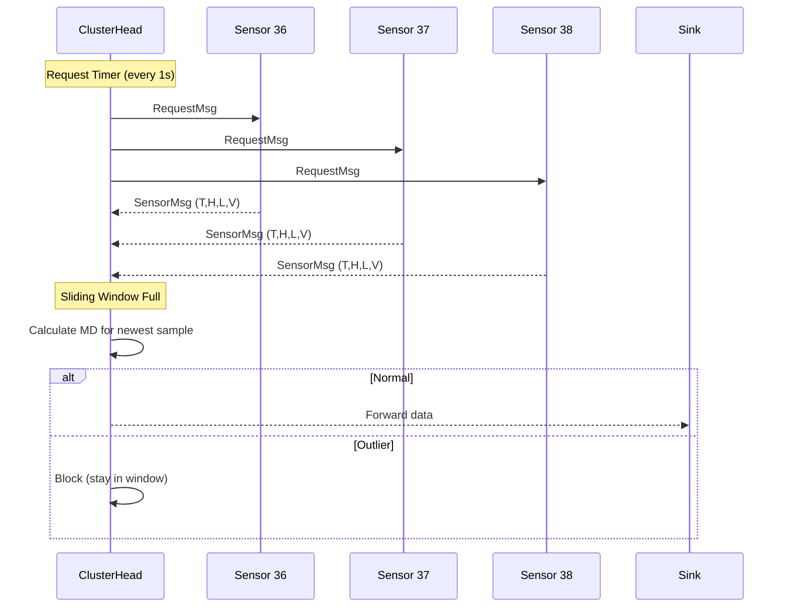

# ODA-MD: Outlier Detection Algorithm based on Mahalanobis Distance

OMNeT++ simulation of the ODA-MD algorithm for Wireless Sensor Networks with **Sliding Window** real-time processing.

> **Paper**: Titouna et al., *"Outlier Detection Algorithm based on Mahalanobis Distance for Wireless Sensor Networks"*, ICCCI-2019

## Features

- **ODA-MD Algorithm**: Mahalanobis Distance based outlier detection with Sliding Window
- **OD Baseline**: Fawzy et al. (2013) algorithm for comparison
- **Real-time Processing**: Detection happens immediately upon receiving each sample
- **Error vs Event Classification**: Distinguishes sensor errors from real events
- **Intel Lab Dataset**: Real sensor data from 54 motes

## Results

| Metric | ODA-MD (Sliding Window) | OD (Batch) | Paper Target |
|--------|-------------------------|------------|--------------|
| Detection Accuracy | **99.49%** | 46.26% | ~95-100% |
| False Alarm Rate | **0.15%** | 14.61% | ~1-5% |
| Energy Consumed | **1123.3 mJ** | 1510.9 mJ | - |
| Processing Mode | Real-time | Batch | - |

## Quick Start

### 1. Download Intel Lab Data

Download `data.txt` (~150MB) from [Intel Lab Data](http://db.csail.mit.edu/labdata/labdata.html) and place in project root.

### 2. Build & Run

```bash
# In OMNeT++ IDE: Import project → Build → Run
# Or use OMNeT++ command line environment
```

## Configurations

| Config | Description |
|--------|-------------|
| `ODAMD` | ODA-MD algorithm with **Sliding Window** (Mahalanobis Distance) |
| `OD` | Baseline OD algorithm (Fawzy et al., 2013) with Sensor Trust |
| `QuickTest` | Quick 100s test run |

## Key Parameters

| Parameter | ODA-MD | OD |
|-----------|--------|-----|
| Threshold | 3.338 (χ²) | 15.0 (cluster width) |
| Window Size | 20 | 20 |
| Processing | Sliding Window | Batch |
| Outliers Injected | 1000 | 1000 |
| Sensors | 36, 37, 38 | 36, 37, 38 |

## Algorithm Comparison

### ODA-MD (Sliding Window)

```
1. Collect 20 samples into sliding window
2. Calculate Mean & Covariance from window
3. For each new sample:
   - Calculate Mahalanobis Distance
   - If MD ≥ 3.338 → OUTLIER (block)
   - Else → NORMAL (forward to sink)
4. Slide window: pop oldest, push newest
```

**Advantages**: Real-time detection, mean "slides" with latest data

### OD Baseline (Fawzy et al., 2013)

```
Step 1: Fixed-Width Clustering
Step 2: Outlier Detection (inter-cluster distance)
Step 3: Classification (Error vs Event)
Step 4: Sensor Trustfulness calculation
```

**Method**: Explicit classification using spatial correlation

## Data Flow



## Project Structure

```text
ODA-MD/
├── src/
│   ├── ClusterHead.cc/.h    # ODA-MD & OD implementation
│   ├── SensorNode.cc/.h     # Intel Lab data reader
│   ├── Sink.cc/.h           # Data receiver
│   ├── EnergyModel.h        # Heinzelman energy model
│   ├── MetricsCollector.h   # DA, FAR, confusion matrix
│   └── IntelLabData.h       # Dataset loader
├── simulations/
│   ├── WSN.ned              # Network topology
│   └── omnetpp.ini          # Configuration
├── documents/               # Reference papers
├── data.txt                 # Intel Lab dataset (download)
├── report.md                # Detailed algorithm explanation
└── result.md                # Simulation results
```

## References

1. Titouna et al., *"ODA-MD for WSN"*, ICCCI-2019
2. Fawzy et al., *"Outliers detection and classification in WSN"*, Egyptian Informatics Journal, 2013
3. Intel Lab Data: http://db.csail.mit.edu/labdata/labdata.html

## License

Educational use. Based on IEEE ICCCI-2019 paper.
